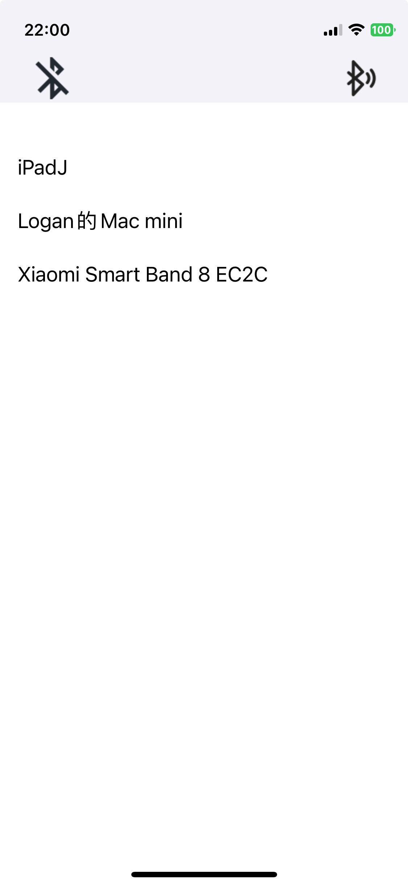

# BluetoothExercise
There are basic BLE fetures and view in this project.  

### BLE Features     
1. Scan peripherals.   
2. Connect peripheral.  
3. Receive data from BLE.  
4. Decode data(not yet)

### Screenshot on iPhone  

### Reference
[BLE(Bluetooth Low Energy) with iOS Swift](https://medium.com/@bhumitapanara/ble-bluetooth-low-energy-with-ios-swift-7ef0de0dff78)
